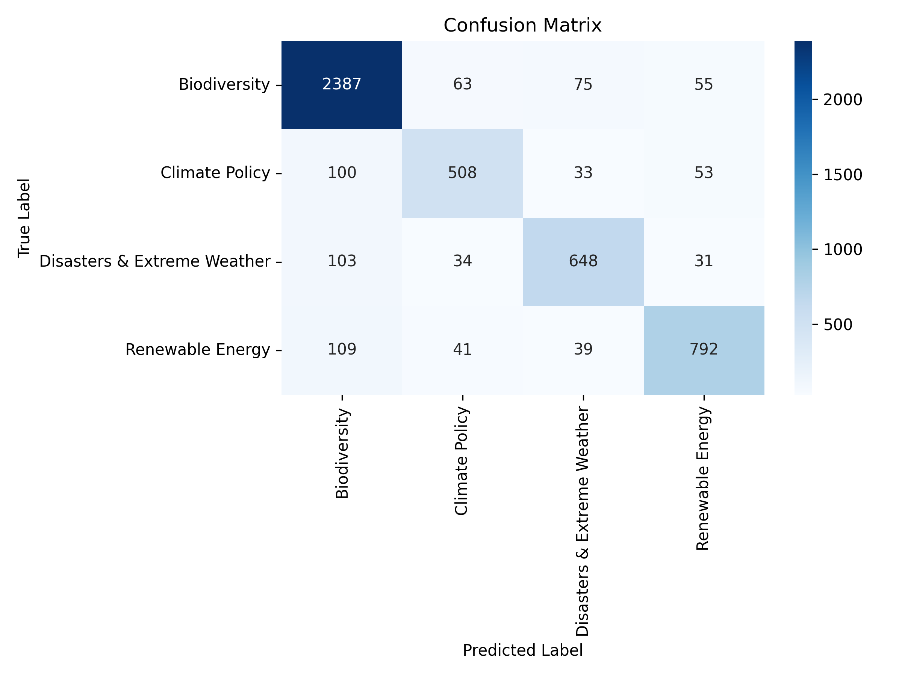

# Environment News Classifier

Ein Machine Learning System zur automatischen Klassifikation von Umwelt- und Klimanachrichten auf basis der der Zeitung *The Guardian*. Das Projekt nutzt **Weak Supervision** zur Label-Generierung, **NLP-Preprocessing mit spaCy** (Lemmatisierung & sublineares TF-IDF) sowie einen **kalibrierten Linear Support Vector Classifier (LinearSVC)** zur Vorhersage.

## Dataset Reference

Der Rohdatensatz stammt von Kaggle und enthält Umwelt- und Klimanachrichten des Guardian:
* **Kaggle Dataset:** [Guardian Environment-Related News](https://www.kaggle.com/datasets/beridzeg45/guardian-environment-related-news)


## Overview & Features

* **Weak Supervision:** Automatische Erstellung von Trainingslabels basierend auf fachspezifischen Keyword-Regeln (Klassen: *Climate Policy*, *Biodiversity*, *Renewable Energy*, *Disasters & Extreme Weather*).
* **Advanced Text Preprocessing:** NLP-Pipeline mit `spaCy` für Lemmatisierung, Stopword-Filtering und sublineare TF-IDF-Skalierung.
* **Calibrated Machine Learning:** LinearSVC gekoppelt mit `CalibratedClassifierCV` zur Ausgabe mathematisch präziser Konfidenz-Scores.
* **Model Diagnostics & Error Analysis:** Visualisierung der Konfusionsmatrix, Extraktion der einflussreichsten Wörter je Kategorie und Identifikation unsicherer Fehlklassifikationen.
* **Interactive Web App:** Testen von eigenen Freitexten und Überprüfen der Wahrscheinlichkeitsverteilung über eine Streamlit-GUI.


## Project Structure

```text
ML_Environment/
├── app.py                            # Interactive Streamlit Web App
├── main.py                           # Execution pipeline entry point
├── README.md                         # Project documentation
├── .gitignore                        # Git exclusion filters
├── data/
│   ├── guardian_environment_news.csv # Raw news dataset (Download via Kaggle)
│   └── processed/                   # Cached labeled datasets
├── models/
│   ├── tfidf_vectorizer.joblib       # Saved TF-IDF vectorizer
│   ├── best_model.joblib             # Saved calibrated classifier
│   └── confusion_matrix.png          # Evaluation confusion matrix plot
└── src/
    ├── analyzer.py                   # Feature importance, plot & error analysis
    ├── config.py                     # Path definitions & keyword dictionary
    ├── data_loader.py                # Data ingestion and caching
    ├── labeling.py                   # Weak supervision rule application
    ├── models.py                     # Feature extraction and model benchmarking
    ├── predictor.py                  # Inference wrapper with threshold rejection
    └── utils.py                      # Joblib artifact handling
```

## Installation & Setup

### 1. Repository klonen & Conda-Umgebung erstellen

git clone https://github.com/your-username/ML_Environment.git
cd ML_Environment

```bash
conda create -n environment_nlp python=3.10 -y
conda activate environment_nlp
```

### 2. Abhängigkeiten installieren

```bash
conda install -c conda-forge spacy pandas scikit-learn matplotlib seaborn streamlit tqdm -y
```

#### Englisches spaCy-Sprachmodell installieren
```bash
pip install https://github.com/explosion/spacy-models/releases/download/en_core_web_sm-3.7.1/en_core_web_sm-3.7.1-py3-none-any.whl
```

### 3. Datensatz herunterladen

Lade `guardian_environment_news.csv` von [Kaggle](https://www.kaggle.com/datasets/beridzeg45/guardian-environment-related-news) herunter und platziere die Datei unter `data/guardian_environment_news.csv`.


## Usage

### 1. Training & Evaluation Pipeline ausführen

Führe das gesamte Training inklusive Weak Supervision, Feature Extraction, Model Benchmarking und Fehleranalyse aus:

```bash
python main.py
```

Um rechenintensive Schritte (z. B. Weak Supervision & Lemmatisierung) bei wiederholten Durchläufen zu überspringen, nutze den Cache-Flag:

```bash
python main.py --skip-preprocessing
```

### 2. Interaktive Streamlit Web App starten

Nutze die grafische Benutzeroberfläche, um eigene Texte in Echtzeit zu klassifizieren und den Schwellenwert für unsichere Vorhersagen anzupassen:

```bash
streamlit run app.py
```

## Model Evaluation & Metrics

Das kalibrierte LinearSVC-Modell erzielt eine Genauigkeit von **~85,5 %** über die vier Hauptkategorien.

Results:
- Linear SVC (Calibrated): Accuracy = 0.8549
- Multinomial Naive Bayes: Accuracy = 0.7405

### Classification Report

| Category | Precision | Recall | F1-Score | Support |
| :--- | :---: | :---: | :---: | :---: |
| **Biodiversity** | 0.88 | 0.93 | 0.90 | 2,580 |
| **Climate Policy** | 0.79 | 0.73 | 0.76 | 694 |
| **Disasters & Extreme Weather** | 0.82 | 0.79 | 0.80 | 816 |
| **Renewable Energy** | 0.85 | 0.81 | 0.83 | 981 |
| **Accuracy** | | | **0.85** | **5,071** |
| **Macro Avg** | 0.83 | 0.81 | 0.82 | 5,071 |
| **Weighted Avg** | 0.85 | 0.85 | 0.85 | 5,071 |

Nach jedem Durchlauf wird automatisch eine **Konfusionsmatrix** unter `models/confusion_matrix.png` gespeichert:

